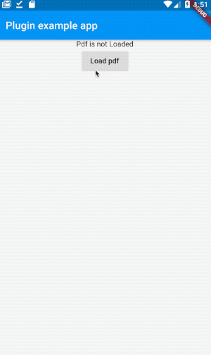

# Pdf Viewer Plugin

[](https://pub.dartlang.org/packages/pdf_viewer_plugin)

A Flutter plugin for IOS and Android providing a simple way to display PDFs.

## Features:

* Display PDF.

 &nbsp; &nbsp; &nbsp; &nbsp; &nbsp; 

## Installation

First, add `pdf_viewer_plugin` as a [dependency in your pubspec.yaml file](https://flutter.io/using-packages/).

### iOS

Add this lines to the `ios/Runner/info.plist`:

```
...

<key>io.flutter.embedded_views_preview</key>
<true/>
```


### Example

The plugin works like a normal widget

```dart
class PdfApp extends StatelessWidget {
  const PdfApp({Key? key}) : super(key: key);

  @override
  Widget build(BuildContext context) {
    return PdfView(path: 'pdf_file_path');
  }
}
```

[Feedback welcome](https://github.com/lubritto/Pdf_Viewer_Plugin/issues) and
[Pull Requests](https://github.com/lubritto/Pdf_Viewer_Plugin/pulls) are most welcome!
